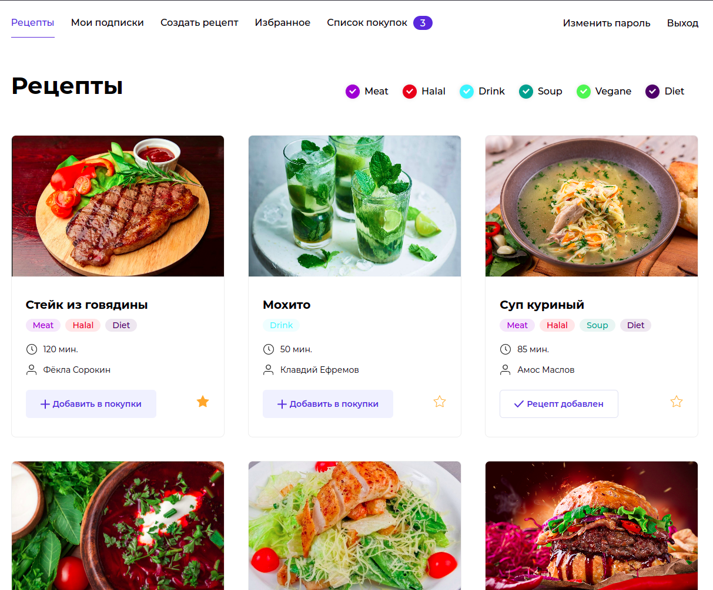
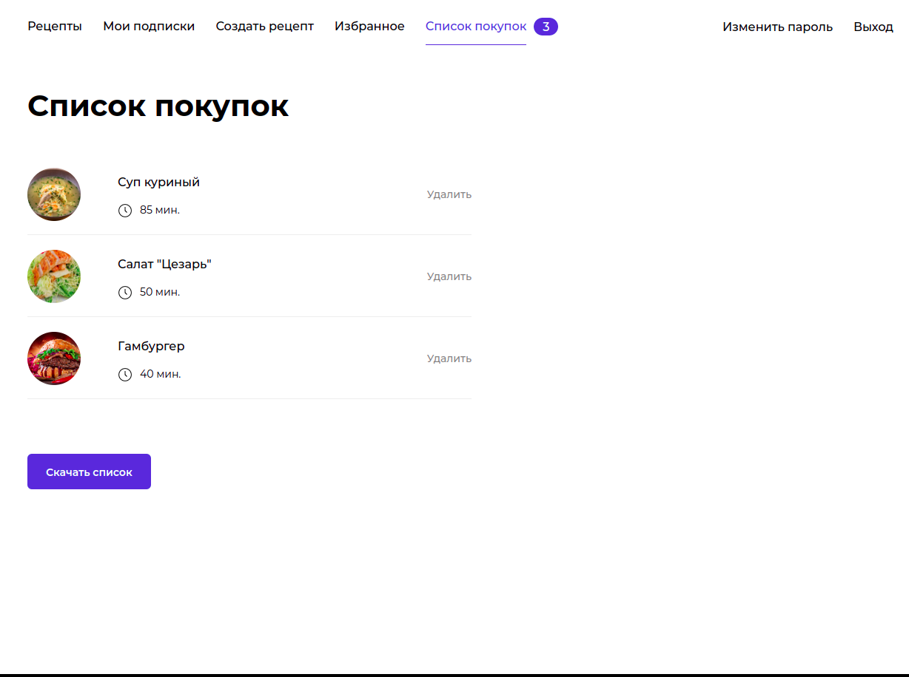
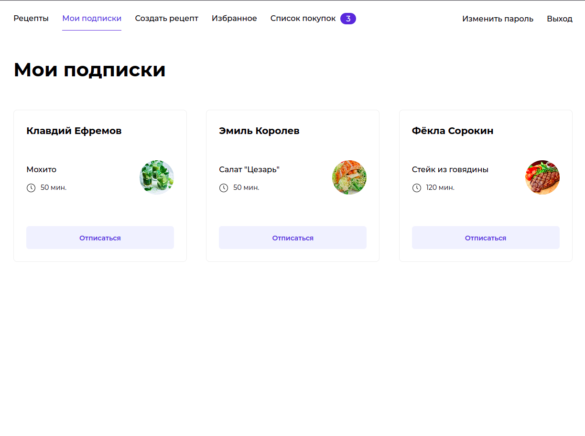
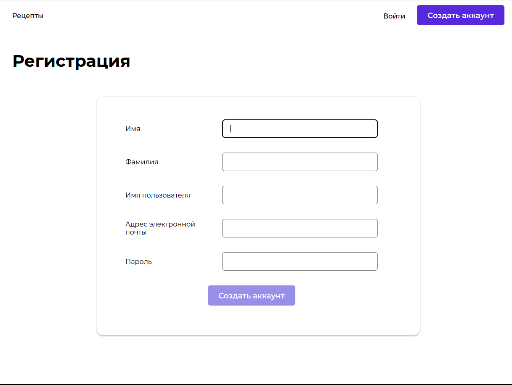

## Проект «Продуктовый помощник»
### Описание проекта
Foodgram - Продуктовый помощник. Сервис позволяет публиковать рецепты, подписываться на публикации других пользователей, добавлять понравившиеся рецепты в список "Избранное", а перед походом в магазин - скачивать сводный список продуктов, необходимых для приготовления одного или нескольких выбранных блюд.

Реализован следующий функционал:

1. [x] Регистрация
2. [x] Авторизация и аутентификация _(стратегия - jwt-token в headers)_
3. [x] CRUD операции с сущностью **User**. Расширена модель прав пользователя
4. [x] CRUD операции с сущностью **Recipes**
5. [x] CRUD операции с сущностью **Ingredients**
6. [x] Модели имеют расширенный функционал: реализован поиск по полям и тегам, фильтрация, сортировка, пагинация, добавление в избранное и корзину.

---

### Стек технологий
- Front-end: [React.js](https://react.dev/)
- Back-end: [Django](https://www.djangoproject.com/)
- Database: [PostgreSQL](https://www.postgresql.org/)
- Version Control: [Git](https://git-scm.com/) and [GitHub](https://github.com/)
- Containerization: [Docker](https://www.docker.com/)
- Infrastructure: [Nginx](https://nginx.org/) and [Yandex.Cloud](https://cloud.yandex.ru/)

---

### Инструкция по запуску проекта:

1. Клонируйте репозиторий
```bash
git clone git@github.com:Fr0stFree/FoodGram.git
```
2. Перейдите в директорию проекта
```bash
cd FoodGram/
```
3. Запустите проект с помощью команд Makefile 
_(необходимо наличие установленного Docker и плагина compose V2)_
```bash
sudo make run ENV=prod
```
###### Данная команда запустит проект в продакшн режиме - создаст контейнеры, соберет статику, применит миграции, создаст суперпользователя, наполнит базу данных и запустит проект на 80 порту

---

### Верстка 

<section>
    <details>
        <summary> Главная страница </summary>
        
    </details>
    <details>
        <summary> Покупки </summary>
        
    </details>
    <details>
        <summary> Подписки </summary>
        
    </details>
    <details>
        <summary> Страница регистрации </summary>
        
    </details>
</section>

